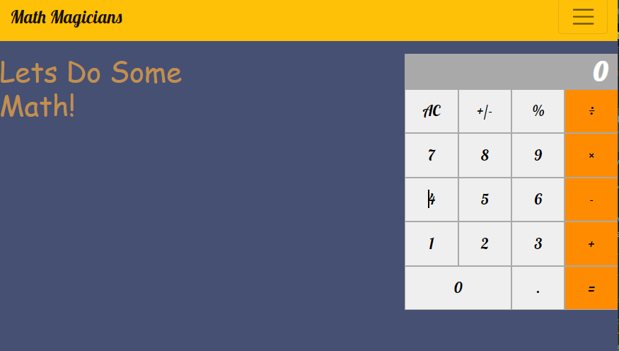

# Math Magicians

> "Math magicians" is a website for all fans of mathematics. It is a Single Page App (SPA) that allows users to:

- Make simple calculations.
- Read a random math-related quote.

This application is built using React and Bootstrap.

## Preview

## Built With

- React
- VSCode
- Gitflow & GitHub

## Live Demo

- Netlify: [Live Demo Link](https://618296d7d88a00ec2d3794e4--elated-mccarthy-57a100.netlify.app/)

## Getting Started

To get this project up and running, follow these simple steps:

1. Clone the repository into your machine.
2. Open the project's folder with your preferred source-code editor.
3. Run `npm install`.
4. Run `npm start`.

### Prerequisites

- Any modern web browser.
- Any source-code editor (VSCode recommended).

### Setup

- Follow the steps described before.

## Authors

👤 **Moaz El Molkey**

- GitHub: [@iammouaz](https://github.com/iammouaz)
- Twitter: [@MoazMulki1](https://twitter.com/MoazMulki1)
- LinkedIn: [Mouaz El Molkey](https://www.linkedin.com/in/mohammad-mouaz-molki-1368981bb/)

## 🤝 Contributing

Contributions, issues, and feature requests are welcome!

Feel free to check the [issues page](https://github.com/iammouaz/Math-Magicians/issues).

## Show your support

Give a ⭐️ if you like this project!
